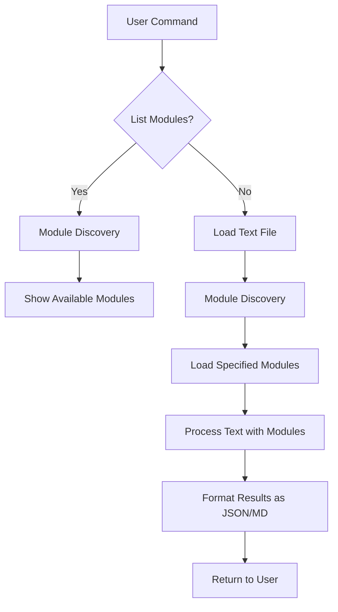

# Write Proofread Software - Architecture Summary

## Overview

This document provides a comprehensive summary of the write proofread software architecture, including all components, their interactions, and implementation details.

## System Architecture



## Component Details

### 1. Main Application (main.py)

The main application handles:
- Command-line argument parsing
- Text file loading
- Module discovery and loading
- Text processing with specified modules
- Result formatting and output

Key functions:
- `discover_modules()` - Automatically finds and loads all modules from the modules directory
- `list_modules()` - Displays all available modules with their descriptions
- `process_text()` - Processes text with specified modules and returns results
- `main()` - Entry point that handles command-line arguments

### 2. Module System

#### Base Module Interface (modules/base_module.py)

All modules must inherit from the `BaseModule` abstract class and implement:

```python
class BaseModule(ABC):
    @abstractmethod
    def name(self) -> str:
        """Return the name of the module (used for identification)"""
        pass
    
    @abstractmethod
    def description(self) -> str:
        """Return a description of what the module does"""
        pass
    
    @abstractmethod
    def process(self, text: str) -> dict:
        """Process the text and return results in standardized format"""
        pass
```

#### Module Discovery Mechanism

The application automatically discovers modules by:
1. Scanning the `modules/` directory for Python files
2. Dynamically loading each module
3. Instantiating classes that inherit from `BaseModule`
4. Registering them by their `name()` method

### 3. Isolated Pronouns Module (modules/isolated_pronouns.py)

The first implemented module identifies isolated pronouns that don't carry specific meaning by themselves:
- "this"
- "that" 
- "these"
- "those"

The module uses regular expressions with word boundaries to ensure it only matches complete words.

Sample output:
```json
{
  "module_name": "isolated_pronouns",
  "module_description": "Identifies isolated pronouns that don't carry specific meaning by themselves",
  "results": [
    {
      "text_span": "this",
      "position": 0,
      "explanation": "isolated pronoun"
    }
  ]
}
```

## Directory Structure

```
writing_master/
├── main.py                 # Main application script
├── text/                   # Text files for proofreading
│   └── sample.txt          # Sample text for testing
├── modules/                # Proofreading modules
│   ├── __init__.py         # Python package initializer
│   ├── base_module.py      # Abstract base class for modules
│   └── isolated_pronouns.py # Isolated pronouns detector
└── README.md               # Project documentation
```

## Command-Line Interface

### List Available Modules
```bash
python main.py --list-modules
```

### Process Text with Modules
```bash
python main.py --text-file path/to/text.txt --modules isolated_pronouns
```

### Process Text with Multiple Modules
```bash
python main.py --text-file path/to/text.txt --modules isolated_pronouns,other_module
```

## Extensibility

To create a new module:
1. Create a new Python file in the `modules/` directory
2. Inherit from `BaseModule`
3. Implement the required methods (`name()`, `description()`, `process()`)
4. The module will be automatically discovered and available for use

## Data Flow

1. User provides command-line arguments
2. Application discovers and loads specified modules
3. Application reads text file
4. Each module processes the text independently
5. Results are collected and formatted as JSON
6. Output is returned to the user

## Result Format

All modules must return results in this standardized JSON format:
```json
{
  "module_name": "unique_module_identifier",
  "module_description": "Description of what this module does",
  "results": [
    {
      "text_span": "matched_text",
      "position": character_position_in_text,
      "explanation": "Markdown formatted explanation of why this was matched"
    }
  ]
}
```

## Implementation Status

- [x] Project structure designed
- [x] Module interface defined
- [x] Main application designed
- [x] Isolated pronouns module designed
- [x] Sample text created
- [x] Documentation completed

## Next Steps

To implement this design:
1. Switch to Code mode to create the actual Python files
2. Implement the main application script
3. Implement the base module class
4. Implement the isolated pronouns module
5. Create the text directory and sample files
6. Test the implementation