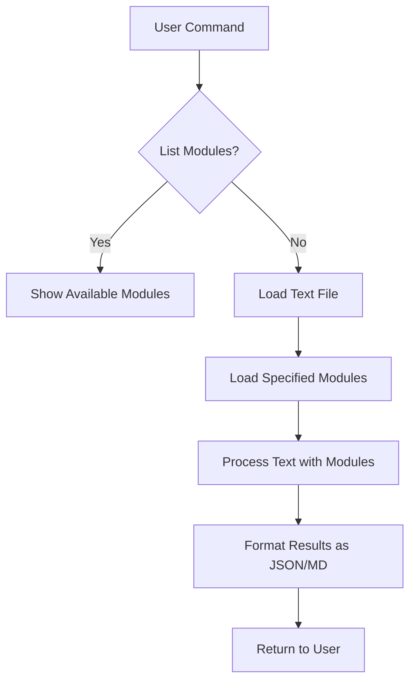

# Write Proofread Software - Project Structure

## Directory Structure
```
writing_master/
├── main.py                 # Main script to run the proofreader
├── text/                   # Folder to store text files for proofreading
│   └── sample.txt          # Sample text file for testing
├── modules/                # Folder to store all proofreading modules
│   ├── __init__.py         # Makes modules a Python package
│   ├── base_module.py      # Abstract base class for all modules
│   └── isolated_pronouns.py # First implementation: isolated pronouns detector
└── README.md               # Project documentation
```

## Component Design

### 1. Main Script (main.py)
- Command-line argument parsing
- Load text file specified by user
- Discover and load modules from modules folder
- Execute specified modules on text
- Format and return results in JSON/MD format

### 2. Module Interface (base_module.py)
- Abstract base class that all modules must inherit from
- Required methods:
  - `name()` - Returns the module's name
  - `description()` - Returns what the module does
  - `process(text)` - Process the text and return results
- Standardized result format

### 3. Isolated Pronouns Module (isolated_pronouns.py)
- Identifies isolated pronouns: "this", "that", "these", "those"
- Returns matches with context and explanation
- Follows the standard module interface

### 4. Command-Line Interface
```
# List available modules
python main.py --list-modules

# Process text with specific module
python main.py --text-file text/sample.txt --module isolated_pronouns

# Process text with multiple modules
python main.py --text-file text/sample.txt --modules isolated_pronouns,other_module
```

## Data Flow Diagram



## Module Result Format

Each module should return results in this JSON format:
```json
{
  "module_name": "isolated_pronouns",
  "module_description": "Identifies isolated pronouns that don't carry specific meaning by themselves",
  "results": [
    {
      "text_span": "this",
      "position": 15,
      "explanation": "isolated pronoun"
    },
    {
      "text_span": "that",
      "position": 42,
      "explanation": "isolated pronoun"
    }
  ]
}